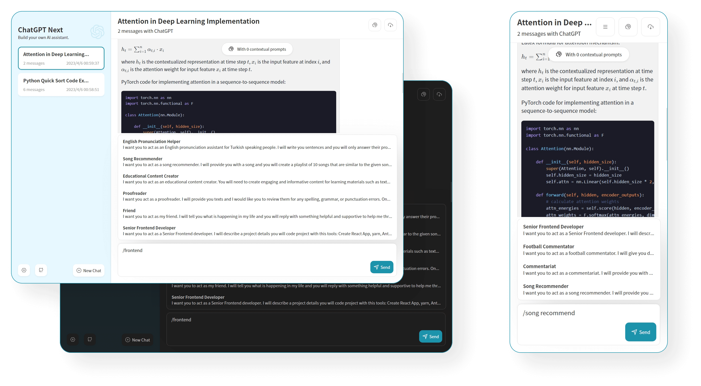

<h1 align="center">ChatGPT Web 杰哥</h1>

[演示(需科学上网)](https://chat-gpt-jiege.vercel.app/) / [QQ](https://qm.qq.com/cgi-bin/qm/qr?k=T1J3Re6JGx4pVLLSQqRJp0lxKR2eDMC2&noverify=0&personal_qrcode_source=4) / [打赏开发者](https://i.postimg.cc/0jr9LVR4/20230421125345.jpg)

## 主要功能

- 精心设计的 UI，响应式设计，支持深色模式
- 极快的首屏加载速度（~100kb）
- 海量的内置 prompt 列表
- 自动压缩上下文聊天记录，在节省 Token 的同时支持超长对话
- 一键导出聊天记录，完整的 Markdown 支持
- [ ] 提示词模板：使用预制上下文快速定制新对话
- [ ] 分享为图片，分享到 ShareGPT
- [ ] 使用 tauri 打包桌面应用
- [ ] 支持自部署的大语言模型
- [ ] 插件机制，支持联网搜索、计算器、调用其他平台 api

## 使用教程(必看)

- 你需要一个[加速器(科学上网工具)点击获取](https://knmvc.com/s/hqsc11)

- 按照教程启动加速器后,就可以访问ChatGPT网站了,[点击进入官网](https://chat-gpt-next-web.vercel.app/)

> 访问密码: `yanglianjie`
> API Key: 有 API Key 的就填自己的,没有 API Key 的 [点击加QQ](https://qm.qq.com/cgi-bin/qm/qr?k=T1J3Re6JGx4pVLLSQqRJp0lxKR2eDMC2&noverify=0&personal_qrcode_source=4) 免费获取

- 接下来是使用,例如↓

- ChatGPT在考试方面的表现,它现在还在进步.

## 捐赠

- 如果你觉得这个项目对你有帮助，并且情况允许的话，可以给我一点点支持，总之非常感谢支持～

- 微信↑

- 支付宝 ↑
